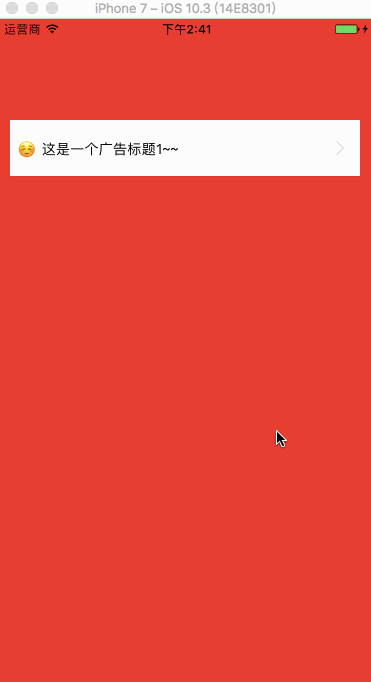

# LSMarqueeView
A fast-integrated marquee(跑马灯)

## How to use
add the head file to your project

```objc
// >>>>>> dataSorce >>>>>
NSMutableArray *tempArr = @[].mutableCopy;
UILabel *labelOne = [UILabel new];
labelOne.font = [UIFont systemFontOfSize:14];
labelOne.text = @"☺ 这是一个广告标题1~~";
labelOne.textColor = [UIColor blackColor];

UILabel *labelTwo = [UILabel new];
labelTwo.font = [UIFont systemFontOfSize:14];
labelTwo.text = @"☺ 这是一个广告标题2~~";
labelTwo.textColor = [UIColor blackColor];

UILabel *labelThree = [UILabel new];
labelThree.font = [UIFont systemFontOfSize:14];
labelThree.text = @"☺ 这是一个广告标题3~~";
labelThree.textColor = [UIColor blackColor];

[tempArr addObject:labelOne];
[tempArr addObject:labelTwo];
[tempArr addObject:labelThree];
// >>>>>> dataSorce >>>>>

self.marqueeView = [[LSMarqueeView alloc] initWithFrame:CGRectMake(10, 100, 354, 60)];
self.marqueeView.lsLabelArr = tempArr;
[self.marqueeView beginShowAdd];
[self.view addSubview:self.marqueeView];

self.marqueeView.clickBlock = ^(id sender){
    NSLog(@"sender %@", sender);
};
```

## Example
